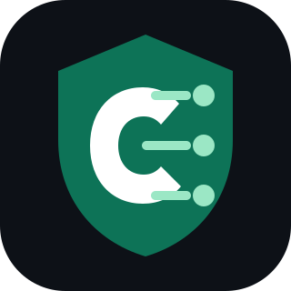

<p align="center">
  
</p>

# Corehole

Corehole is a [CoreDNS](https://coredns.io/)-based DNS sinkhole inspired by the excellent
[Pi-hole](https://pi-hole.net/) project. It runs as a standalone binary that
starts both:

- a DNS service backed by [CoreDNS](https://coredns.io/)
- a browsable web admin dashboard for setup, login/logout, status, blocklists,
  query logs, analytics, clients/groups, custom DNS, settings, and API keys

The DNS service loads a small bundled seed blocklist, configured local
blocklists, and subscribed lists managed from SQLite. It blocks matching
queries, forwards everything else to the configured upstream resolvers, and
records DNS audit events in SQLite.

## Why

Corehole exists because Pi-hole-style DNS filtering is useful, but Pi-hole
deployments involve multiple runtime pieces such as Pi-hole itself, FTLDNS with
its embedded dnsmasq-based resolver, a web server like lighttpd or another
external server, and PHP; Corehole packages forwarding DNS, filtering, the admin
console, configuration, API keys, audit logging, analytics, and SQLite storage
into one standalone binary so install and upgrade are mostly a binary
replacement instead of coordinating OS packages that may not stay compatible
with the host distribution.

## Quick Start

Start corehole:

```sh
corehole serve
```

The built-in defaults are enough for a first run:

- DNS: `:53` for UDP and TCP DNS queries; test locally at `127.0.0.1`
- Admin console: `http://127.0.0.1:8080`
- Upstream resolver: Cloudflare at `1.1.1.1:53`
- SQLite storage: `./corehole.db`
- Blocking: bundled seed blocklist enabled, blocked responses return `NXDOMAIN`
- DNS cache: 3600 second successful-response TTL cap, 30 second denial TTL cap,
  32,768 successful-response entries, 4,096 denial/failure entries, and bounded
  prefetch for popular cache entries
- Logging: text-formatted startup-oriented Corehole info logs and CoreDNS error
  logs enabled; `debug` enables admin access logs and CoreDNS query logs

Binding DNS port 53 usually requires root/admin privileges or a service manager
capability such as `CAP_NET_BIND_SERVICE`. For unprivileged local development,
start with a small YAML override that only changes the DNS listener:

```yaml
dns:
  listen: ":1053"
```

Then run:

```sh
corehole serve --config ./corehole.yaml
```

Open the admin console in a browser:

```text
http://127.0.0.1:8080
```

Print the binary version:

```sh
corehole version
```

On first run for a SQLite database, the console asks you to create the first
admin password. Admin users and API keys are persisted in the configured
SQLite database and survive restarts as long as `storage.path` points at the
same database. Browser sessions are stored in SQLite and survive restarts until
they expire or are explicitly logged out. After login, use the web console to
manage blocklists, upstream resolvers, DNSSEC assistance, custom DNS,
clients/groups, analytics, settings, and API keys.

## Runtime Dependencies

Corehole is intended to run as a standalone binary. SQLite support is compiled
into the binary through the Go SQLite driver, so SQLite does not need to be
installed on the host and no external `sqlite3` command is required for normal
operation. The `sqlite3` CLI is only useful for optional manual inspection or
manual database maintenance.

## Configuration

Most configuration should be driven from the web console after `corehole serve`
has initialized the SQLite database. Use YAML only for bootstrap values that
must exist before the console is reachable, such as listener addresses or the
storage path. If the file passed to `--config` does not exist, corehole starts
with the built-in defaults.

On first startup for a SQLite database, the YAML/default config is saved to
`app_config` and becomes the active config. On later startups with the same
database, the persisted `app_config` row is authoritative; YAML changes are not
applied automatically. Startup logs include `config_source` so this is visible.

See [docs/configuration.md](docs/configuration.md) for the full YAML reference,
including field defaults, validation rules, restart caveats, and deployment
examples.

## Blocklists

corehole ships with a small deterministic seed blocklist under
`internal/blocklist` so a fresh install blocks `blocked.example` and a handful
of common ad/tracker hostnames without fetching anything from the internet at
startup. Local blocklists referenced by `blocking.blocklists` are loaded in
addition to the bundled seed list. Set `blocking.bundled: false` to disable the
seed list.

Blocklists added, refreshed, enabled, disabled, or deleted through the admin
console or Admin API are persisted in SQLite and reloaded into the DNS runtime
immediately. Local paths listed in YAML under `blocking.blocklists` are
bootstrap blocklists loaded from the active persisted config; use the admin
console/API for runtime-managed lists.

Blocking can also be paused from the Blocklists page for a fixed duration or
indefinitely. A pause takes effect immediately and is persisted in SQLite, so it
survives restarts until the duration expires or blocking is resumed.

Currently supported formats:

```text
# comments and blank lines are ignored
blocked.example

# hosts-file style lines are supported
0.0.0.0 ads.example tracker.example
127.0.0.1 metrics.example

# suffix/wildcard entries are supported
*.bad.example
```

Notes:

- Plain domain lines contain one domain per line.
- Hosts-file lines start with an IP address followed by one or more domains.
- Anything after `#` is treated as a comment.
- Domains are normalized to lowercase and may include a trailing dot.
- `*.example.com` entries are suffix rules for subdomains under
  `example.com`.

## DNS Smoke Test

With the default bundled seed list enabled, query a bundled smoke-test domain:

```sh
dig @127.0.0.1 blocked.example A
```

If you changed `dns.listen` to `:1053` for unprivileged development, query that
listener with `dig @127.0.0.1 -p 1053 blocked.example A`.

To test a custom list instead, add a URL or local file path from the Blocklists
page in the admin console, refresh the list, then query a domain from that list.
For a quick local-file test, create a file:

```sh
printf 'custom-blocked.example\n' > ./blocklist.txt
```

Then add `./blocklist.txt` from the Blocklists page and refresh it.

Query the custom blocked domain:

```sh
dig @127.0.0.1 custom-blocked.example A
```

With `blocking.response: nxdomain`, the response should be `NXDOMAIN`. With
`null-ip`, A queries return `0.0.0.0` and AAAA queries return `::`. With
`refused`, blocked queries return `REFUSED`.

## Release Builds

Release binaries are built with [GoReleaser](https://goreleaser.com/). The
configuration emits archives for common Linux, FreeBSD, macOS, and Windows
targets, including `amd64`, `arm64`, and Linux ARM variants.

Build a local snapshot without publishing:

```sh
goreleaser release --snapshot --clean
```

Create a tagged release from CI or a release-capable workstation:

```sh
git tag v0.1.0
goreleaser release --clean
```

The release build injects the tag into `corehole version`.

GitHub Actions runs `golangci-lint`, `go test ./...`, and admin JavaScript
syntax checks on pushes and pull requests. Pushing a `v*` tag, for example
`v0.1.0`, runs lint, tests, GoReleaser, and publishes the release artifacts to
GitHub Releases.

## Admin API

The admin API is served from the same listener as the console.

- `GET /api/status`: returns setup and session state, including
  `setup_required` and `authenticated`.
- `POST /api/setup`: creates the first admin password from JSON
  `{"password":"..."}`. Returns `409 Conflict` after setup already exists.
- `POST /api/login`: logs in with JSON `{"password":"..."}` and sets the
  admin session cookie.
- `POST /api/logout`: requires authentication, deletes the current
  session, and expires the cookie.
- `GET /api/api-keys`: requires authentication and lists API key metadata
  without raw secrets.
- `POST /api/api-keys`: requires authentication, creates an API key from JSON
  `{"name":"automation"}`, and returns the raw `key` only once.
- `DELETE /api/api-keys/{id}`: requires authentication and revokes an API key.
- `GET /api/dashboard`: requires authentication and returns the
  dashboard summary. All-time counters are exposed as `total_queries`,
  `blocked_queries`, and `allowed_queries`; legacy recent-window counters remain
  available as `total_recent_queries`, `blocked_recent_queries`, and
  `allowed_recent_queries`.
- `GET /api/config`: requires authentication and returns the
  persisted active configuration.
- `PUT /api/config`: requires authentication and saves the persisted
  configuration. DNS resolver/cache/conditional-forwarding/DNSSEC changes can
  apply through DNS hot reload when the DNS listen address is unchanged and the
  updater has a DNS reloader; otherwise the response includes
  `restart_required: true`.
- `GET /api/blocking/status`: requires authentication and returns whether
  blocking is active, paused indefinitely, or paused until a timestamp.
- `PUT /api/blocking/status`: requires authentication and pauses or resumes
  blocking. Use `{"paused":true,"duration_seconds":300}` for a timed pause,
  `{"paused":true}` for an indefinite pause, and `{"paused":false}` to resume.
- `GET /api/queries?limit=100`: requires authentication and returns
  recent DNS audit events. `limit` is optional.
- `GET /api/analytics/summary`: requires authentication and returns analytics
  aggregates, including `total_query_count` for computing frequencies against
  all recorded queries. Client-level analytics include `top_clients`,
  `top_blocked_clients`, and `client_time_buckets` for per-client activity
  views.

Protected JSON API endpoints accept either the browser session cookie or an API
key:

```sh
curl -s -b cookie.txt \
  -H 'Content-Type: application/json' \
  -d '{"name":"automation"}' \
  http://127.0.0.1:8080/api/api-keys

curl -s \
  -H "Authorization: Bearer $COREHOLE_API_KEY" \
  http://127.0.0.1:8080/api/config
```

`Authorization: Bearer <key>` is preferred. `X-Corehole-API-Key: <key>` is also
accepted.

## Operational Workflow

1. Start corehole with `corehole serve`.
2. Open the admin console and create the first admin password for this database.
3. Point a client or test command at the configured DNS listener.
4. Manage blocklists, upstream resolvers, DNSSEC assistance, custom DNS, clients,
   groups, and API keys from the admin console. Runtime-managed DNS settings and
   blocklists take effect without a restart when the DNS listener address is
   unchanged; listener changes still require a restart.

## Development

```sh
go test ./...
golangci-lint run
go build ./cmd/corehole
go run ./cmd/corehole serve
```

## License

Corehole is licensed under the [Apache License 2.0](LICENSE).
